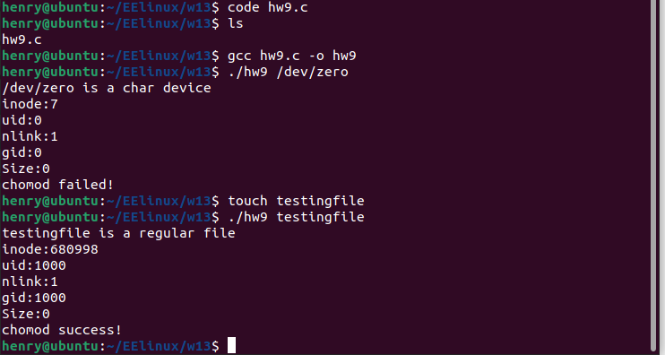
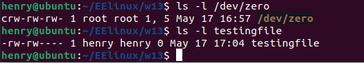

# <center> **Linux文件系统操作**

#### <p align =right>**201180189 周子航**

##  **一、实验要求**
编写hw9.c 按顺序完成以下操作，编译链接调试运行：

a) 输入文件名称，能够判断文件类型(规则文件，目录，字符设备，块设备，管道，符号链接，套接字等)，判断实际用户对该文件是否具有读权限；

b) 要求打印出文件类型信息，inode节点编号，链接数目，用户id，组id，文件大小信息；

c) 修改文件的权限为当前用户读写，组内用户读写，组外用户无权限。

提示：需用到stat结构体，open(), fstat(), access() 等函数，以及获取文件类型的宏。

## **二、实验代码展示及分析**
```c
#include <stdio.h>
#include <stdlib.h>
#include <sys/stat.h>
#include <sys/types.h>
#include <unistd.h>
#include <fcntl.h>
#include <time.h>
#include <string.h>

#define MAX 50
```

**1.需要使用的库及宏。**
```c
int main(int arg,char *argv[])
{
struct stat buf;
int fd;
char addr[MAX];
strcpy(addr,argv[1]);

```
**2.定义stat结构体指针buf，文件描述符fd以及用于存放文件路径的字符数组addr。**
```c
fd = open(addr, O_RDWR|O_CREAT);
fstat(fd, &buf);
if (S_ISREG(buf.st_mode))
    printf("%s is a regular file\n",addr);
if (S_ISCHR(buf.st_mode))
    printf("%s is a char device\n",addr);
if (S_ISLNK(buf.st_mode))
    printf("%s is a symbol link\n",addr);
if (S_ISSOCK(buf.st_mode))
    printf("%s is a socket\n",addr);
if (S_ISDIR(buf.st_mode))
    printf("%s is a directory\n",addr);
if (S_ISBLK(buf.st_mode))
    printf("%s is a block\n",addr);
if (access(addr,R_OK)!=0)
    printf("READ PERMISSION DENIED.\n");
```
**3.这块代码用于实现功能a：文件类型判断及判断用户是否具有读权限。**
```c
printf("inode:%ld\n",buf.st_ino);
printf("uid:%d\n",buf.st_uid);
printf("nlink:%ld\n",buf.st_nlink);
printf("gid:%d\n",buf.st_gid);
printf("Size:%ld\n",buf.st_size);
```
**4.这块代码用于实现功能b:打印出inode节点编号，链接数目，用户id，组id，文件大小信息。**
```c
if (chmod(addr,S_IRUSR|S_IWUSR|S_IRGRP|S_IWGRP)==0)
    printf("chomod success!\n");
else
    printf("chomod failed!\n");
}
```
**5.这块代码用于实现功能c：修改文件的权限为当前用户读写，组内用户读写，组外用户无权限。**

## **三、实验结果展示**



**使用ls -l 命令验证：**



**可发现实验成功。**