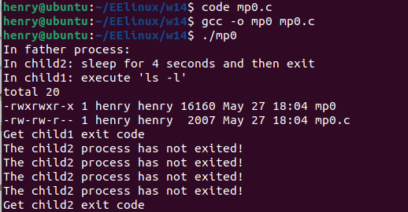

# <center>Linux进程
## <p align ='right'>201180189 周子航

###一、问题
补充完善如下mp0.c代码，将WRITE_YOUR_CODE_HERE 替换成自己的代码。在该程序中，实现了3个进程，其中1个为父进程，其余2个是该父进程创建的子进程，其中一个子进程运行"ls -l"指令，另一个子进程暂停4s之后异常退出，父进程先用阻塞方式等待第一子进程的结束，然后用非阻塞方式等待另一个子进程退出，等待收集到第二个子进程结束的信息，父进程就返回。 

###二、完善代码

```c
/* mp0.c */
#include <stdio.h>
#include <stdlib.h>
#include <sys/types.h>
#include <unistd.h>
#include <sys/wait.h>

int main(void)

{
    pid_t child1, child2, child;
    /* Create the 1st child */

    child1 = fork();        

    /* Error processing */
```
```c
    if ( child1<0 )     // 1st change

    {

        printf("Child1 fork error\n");

        exit(1);

    }
```
```c
    else 

        if ( child1==0 ) /* Call execlp in the 1st child */ //2nd change

       {

           printf("In child1: execute 'ls -l'\n");

           if (execlp("ls", "ls", "-l", NULL) < 0)

           {
               printf("Child1 execlp error\n");
           }
       }
      else /* Create the 2nd child, waiting for the two processes to exit */
      {
          child2 = fork();
          if (child2 == -1) /* Error processing */
          {
              printf("Child2 fork error\n");
              exit(1);
          }
```
```c
          else if( child2==0 ) /* waiting 4 seconds in the 2nd child */  //3rd change
          {
              printf("In child2: sleep for 4 seconds and then exit\n");
            sleep(4);       //4th change
            exit(0);
        }
```
```c
        printf("In father process:\n");
        child = waitpid(child1, NULL, 0); /* waiting the 1st child to exit in BLOCKed way  */  //5th change
          if ( child ==child1 )  //6th change
          {
              printf("Get child1 exit code\n");
          }
          else
          {
              printf("Error occured!\n");
          }
```
```c
          do

          {
              child = waitpid(child2, NULL, WNOHANG); /* waiting the 2nd child to exit in NONBLOCKed way */ //7th change
              if (child == 0)
              {
                  printf("The child2 process has not exited!\n");
                  sleep(1);
              }
          } while (child == 0);
```
```c
          if (child == child2)

        {
            printf("Get child2 exit code\n");
        }
        else
        {
            printf("Error occured!\n");
        }
    }
    return 0;
}
```
###三、运行结果展示
